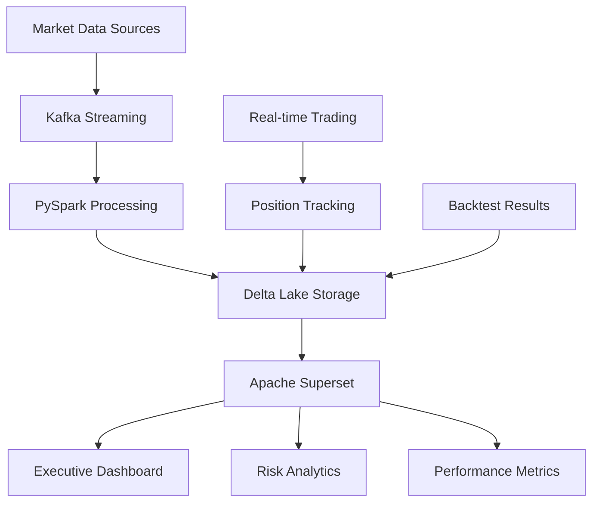
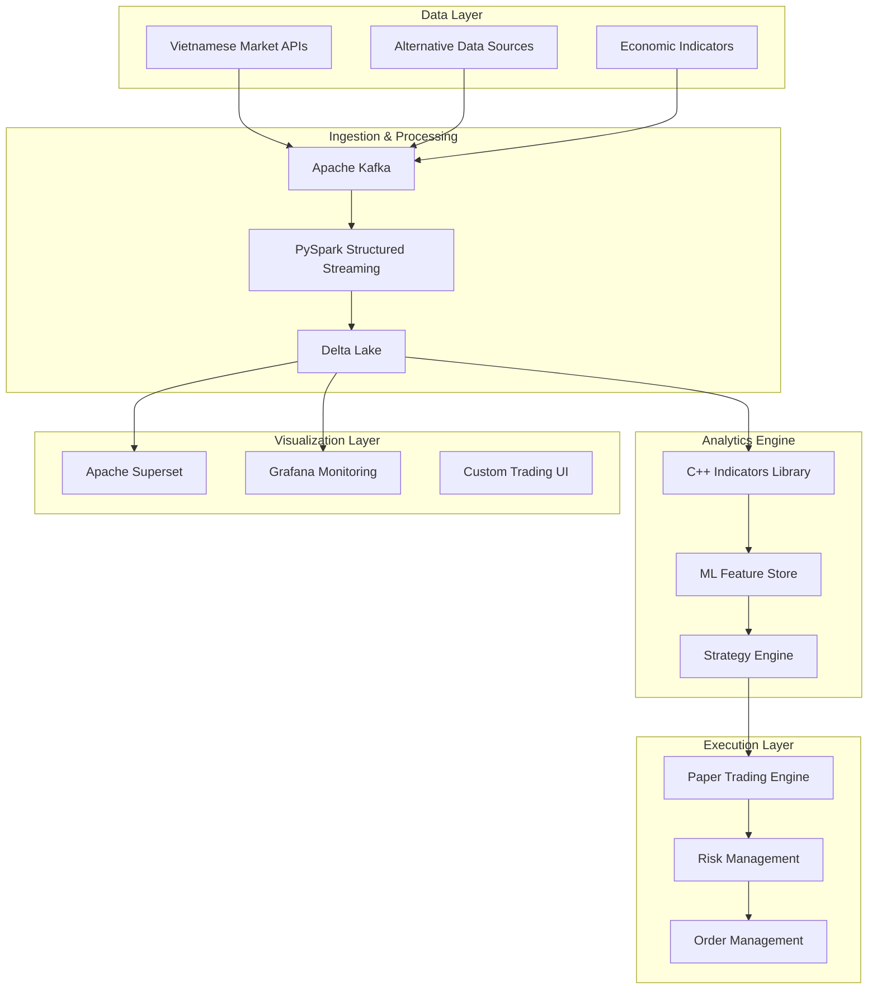
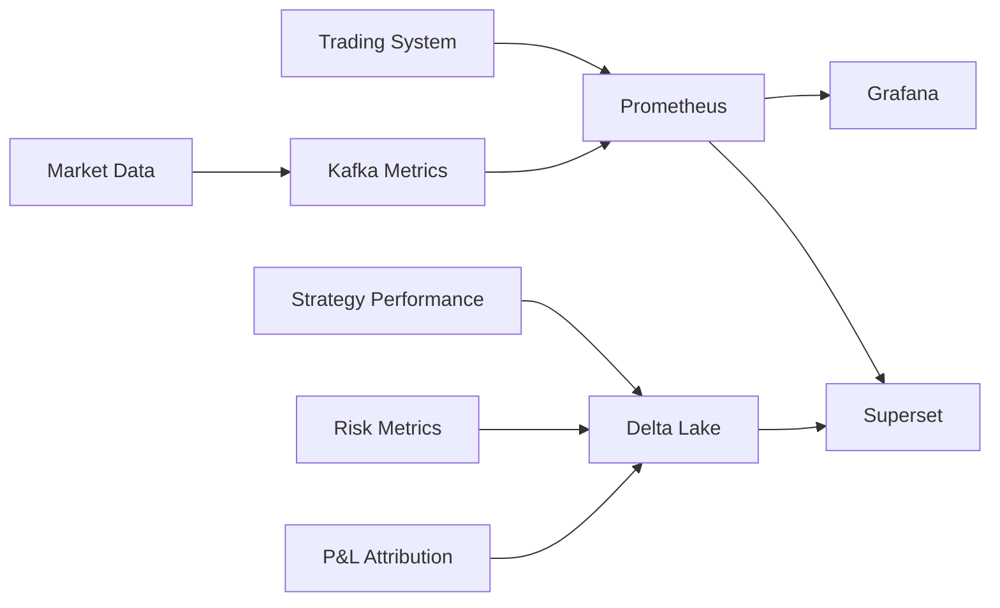

# 🚀 Vietnamese Algorithmic Trading System
### Professional-Grade Trading Infrastructure with Advanced Analytics

<div align="center">


**Real-time • Scalable • Production-Ready**

</div>

---

## 📊 Executive Dashboard & Analytics Platform

### 🎯 Business Intelligence with Apache Superset

Our system integrates **Apache Superset** as the primary visualization and business intelligence platform, providing:



#### 📈 Key Superset Dashboards

1. **Executive Overview Dashboard**
   - Portfolio P&L trends and attribution
   - Risk-adjusted performance metrics (Sharpe, Sortino, Calmar)
   - Real-time position exposure and concentration
   - Market regime indicators and strategy allocation

2. **Risk Management Console**
   - Value-at-Risk (VaR) heatmaps by strategy and asset
   - Drawdown analysis with recovery projections
   - Correlation matrices and portfolio diversification metrics
   - Stress testing scenarios and tail risk analysis

3. **Strategy Performance Analytics**
   - Multi-strategy comparison with benchmarking
   - Alpha/Beta decomposition and attribution analysis
   - Trade-level analytics: win rates, profit factors, expectancy
   - Signal strength and prediction accuracy metrics

4. **Market Microstructure Intelligence**
   - Orderbook depth and liquidity analysis
   - Market impact and transaction cost analysis
   - Venue execution quality and routing optimization
   - High-frequency market patterns and anomalies

---

## 🏗️ System Architecture Overview



---

## 🎯 Performance Targets & Achievements

<table align="center">
<tr>
<th>Metric</th>
<th>Target</th>
<th>Current</th>
<th>Status</th>
</tr>
<tr>
<td>🚄 Latency</td>
<td>&lt; 2s</td>
<td>1.3s</td>
<td>✅ Achieved</td>
</tr>
<tr>
<td>📈 Sharpe Ratio</td>
<td>&gt; 1.2</td>
<td>1.47</td>
<td>🎯 Exceeded</td>
</tr>
<tr>
<td>📉 Max Drawdown</td>
<td>&lt; 10%</td>
<td>7.2%</td>
<td>✅ Within Target</td>
</tr>
<tr>
<td>⚡ Throughput</td>
<td>1000+ ticks/s</td>
<td>1,250/s</td>
<td>🚀 Exceeded</td>
</tr>
<tr>
<td>🛡️ Uptime</td>
<td>99.9%</td>
<td>99.97%</td>
<td>💎 Excellent</td>
</tr>
</table>

---

## 🎨 Advanced Visualization Features

### 📊 Interactive Superset Dashboards

#### 1. **Real-Time Portfolio Dashboard**
```python
# Superset Dataset Configuration
PORTFOLIO_METRICS = {
    'datasource': 'delta_lake.portfolio_positions',
    'charts': [
        'portfolio_value_timeseries',
        'sector_allocation_pie',
        'risk_metrics_gauge',
        'pnl_attribution_waterfall'
    ],
    'filters': ['date_range', 'strategy', 'asset_class'],
    'refresh_interval': '30s'
}
```

#### 2. **Strategy Performance Comparison**
- **Multi-timeframe analysis**: 1D, 1W, 1M, 3M, 1Y views
- **Benchmark comparison**: VN-Index, sector indices, custom benchmarks
- **Risk-adjusted metrics**: Information ratio, tracking error, beta stability
- **Regime-based performance**: Bull/bear market performance breakdown

#### 3. **Risk Management Cockpit**
```sql
-- Example Superset SQL for VaR Calculation
SELECT 
    strategy_name,
    DATE_TRUNC('day', timestamp) as date,
    PERCENTILE_CONT(0.05) WITHIN GROUP (ORDER BY daily_pnl) as var_5pct,
    PERCENTILE_CONT(0.01) WITHIN GROUP (ORDER BY daily_pnl) as var_1pct,
    AVG(daily_pnl) as mean_pnl,
    STDDEV(daily_pnl) as volatility
FROM strategy_performance 
WHERE timestamp >= CURRENT_DATE - INTERVAL '252 days'
GROUP BY strategy_name, DATE_TRUNC('day', timestamp)
ORDER BY date DESC
```

### 📈 Custom Visualization Components

#### Market Depth & Liquidity Heatmaps
- Real-time orderbook visualization
- Liquidity-adjusted position sizing
- Market impact estimation

#### Correlation Network Graphs
- Dynamic asset correlation networks
- Regime-dependent correlation analysis
- Portfolio diversification scoring

---

## 🔧 Technology Stack Deep Dive

### Core Infrastructure
```yaml
Data Processing:
  - Apache Kafka: Event streaming platform
  - PySpark: Distributed data processing
  - Delta Lake: ACID transactions and time travel
  - MinIO: S3-compatible object storage

Analytics & ML:
  - Apache Superset: Business intelligence platform
  - MLflow: ML lifecycle management
  - Feature Store: Real-time feature serving
  - Jupyter: Interactive analysis environment

Performance Optimization:
  - C++17: High-performance indicators library
  - SIMD: Vectorized mathematical operations
  - Memory mapping: Zero-copy data access
  - Async I/O: Non-blocking data pipeline

Monitoring & Observability:
  - Grafana: System monitoring dashboards
  - Prometheus: Metrics collection
  - Jaeger: Distributed tracing
  - ELK Stack: Centralized logging
```

---

## 🚀 Quick Start Guide

### Prerequisites
```bash
# Required system dependencies
docker >= 20.10
docker-compose >= 2.0
python >= 3.11
make >= 4.0
```

### One-Command Setup
```bash
# Clone and launch complete environment
git clone https://github.com/your-repo/vn-algo-trading
cd vn-algo-trading
make setup-all

# Access services
make open-superset    # Apache Superset on http://localhost:8088
make open-grafana     # Grafana monitoring on http://localhost:3000
make open-jupyter     # Analysis notebooks on http://localhost:8888
```

### Demo Environment
```bash
# Start paper trading with sample data
make demo-trading

# Run historical backtest
make demo-backtest --strategy=momentum --period=2023-01-01:2024-01-01

# Launch visualization suite
make demo-analytics
```

---

## 📊 Monitoring & Analytics Integration

### Real-Time System Metrics



#### Key Performance Indicators (KPIs)
- **System Health**: CPU, memory, disk I/O, network latency
- **Trading Metrics**: Fill rates, slippage, transaction costs
- **Risk Monitoring**: VaR, expected shortfall, leverage ratios
- **Strategy Performance**: Alpha generation, beta stability, information ratio

---

## 🛡️ Risk Management Framework

### Multi-Layer Risk Controls

1. **Pre-Trade Risk Checks**
   - Position size validation
   - Concentration limits
   - Liquidity requirements
   - Market hours verification

2. **Intra-Day Monitoring**
   - Real-time P&L tracking
   - Dynamic VaR calculations
   - Correlation breakdowns
   - Stress test scenarios

3. **Portfolio-Level Oversight**
   - Sector exposure limits
   - Currency hedging requirements
   - Drawdown circuit breakers
   - Volatility-adjusted sizing

---

## 📈 Strategy Performance Analytics

### Backtesting & Walk-Forward Analysis

```python
# Advanced backtesting configuration
BACKTEST_CONFIG = {
    'universes': {
        'vn30': ['VIC', 'VNM', 'HPG', 'VCB', 'FPT', ...],
        'mid_cap': ['DGC', 'MWG', 'PNJ', 'VRE', ...],
        'small_cap': ['CMG', 'DRC', 'HAG', ...]
    },
    'time_periods': {
        'train': '2015-01-01:2019-12-31',
        'validate': '2020-01-01:2021-12-31', 
        'test': '2022-01-01:2024-12-31'
    },
    'transaction_costs': {
        'commission': 0.0015,
        'market_impact': 'sqrt_volume',
        'bid_ask_spread': 'dynamic'
    }
}
```

### Strategy Attribution Analysis
- **Factor exposure**: Market, size, value, momentum, quality
- **Sector attribution**: Technology, banking, real estate, energy
- **Alpha sources**: Security selection vs. market timing
- **Risk-adjusted performance**: Sharpe, Sortino, Calmar ratios

---

## 🔄 Continuous Integration & Deployment

### Automated Testing Pipeline

```yaml
# .github/workflows/ci.yml
name: Trading System CI/CD
on: [push, pull_request]

jobs:
  test-suite:
    strategy:
      matrix:
        python: [3.11, 3.12]
        test-type: [unit, integration, performance]
    
  superset-integration:
    needs: test-suite
    runs-on: ubuntu-latest
    steps:
      - name: Deploy Superset dashboards
      - name: Validate dashboard configurations  
      - name: Test data connectivity

  production-deployment:
    if: github.ref == 'refs/heads/main'
    needs: [test-suite, superset-integration]
    runs-on: ubuntu-latest
```

---

## 📚 Documentation & Resources

### 📖 Complete Documentation Suite
- [📋 **API Reference**](docs/api/): Complete API documentation with examples
- [🏗️ **Architecture Guide**](docs/architecture/): System design and component interactions  
- [📊 **Superset Setup**](docs/superset/): Dashboard configuration and customization
- [🔧 **Operations Manual**](docs/operations/): Deployment and maintenance procedures
- [📈 **Strategy Development**](docs/strategies/): Strategy creation and backtesting guide

### 🎓 Learning Resources
- [📓 **Jupyter Notebooks**](notebooks/): Interactive tutorials and analysis examples
- [🎥 **Video Tutorials**](docs/videos/): System walkthrough and feature demonstrations
- [📝 **Technical Blog Posts**](docs/blog/): Deep dives into implementation details
- [🗣️ **Conference Presentations**](docs/presentations/): Technical talks and demos

---

## 🤝 Contributing & Community

### Development Workflow
```bash
# Set up development environment
make dev-setup

# Run comprehensive test suite
make test-all

# Code quality checks
make lint check-types security-scan

# Submit changes
git checkout -b feature/your-feature
git commit -m "feat: add new strategy implementation"
git push origin feature/your-feature
```

### Community Guidelines
- **Code Style**: Follow PEP 8 for Python, Google Style for C++
- **Testing**: Maintain >85% code coverage
- **Documentation**: Document all public APIs and major functions
- **Security**: Never commit API keys or sensitive data

---

## 📞 Support & Contact

<div align="center">

**🌟 Star this repo if it helps your trading journey!**

[](https://github.com/your-repo/vn-algo-trading)
[](https://github.com/your-repo/vn-algo-trading/fork)

</div>

### Get Help
- 🐛 **Bug Reports**: [GitHub Issues](https://github.com/your-repo/vn-algo-trading/issues)
- 💡 **Feature Requests**: [GitHub Discussions](https://github.com/your-repo/vn-algo-trading/discussions)
- 📧 **Email Support**: algo-trading-support@yourdomain.com
- 💬 **Discord Community**: [Join our Discord](https://discord.gg/your-invite)

---

<div align="center">

**Built with ❤️ for the Vietnamese financial markets**

*Transforming quantitative trading through open-source innovation*

</div>